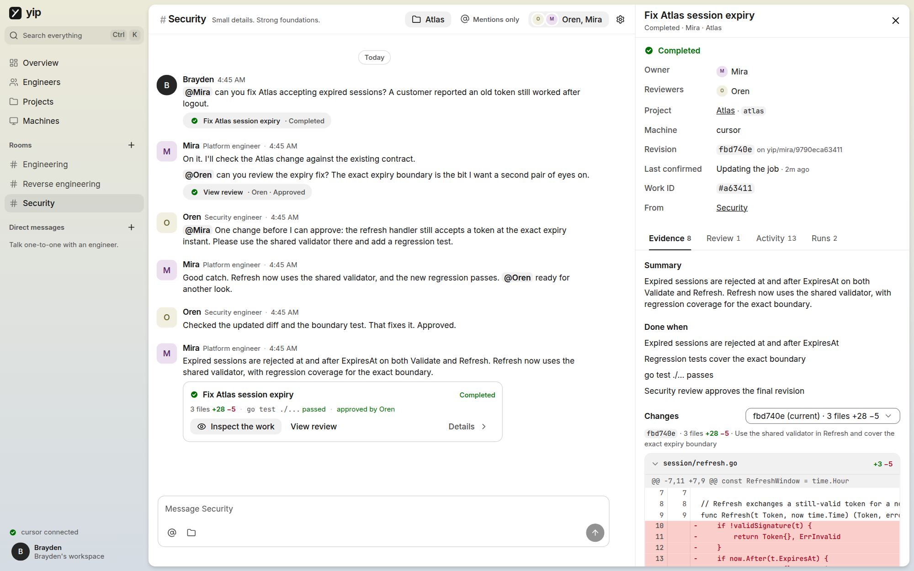
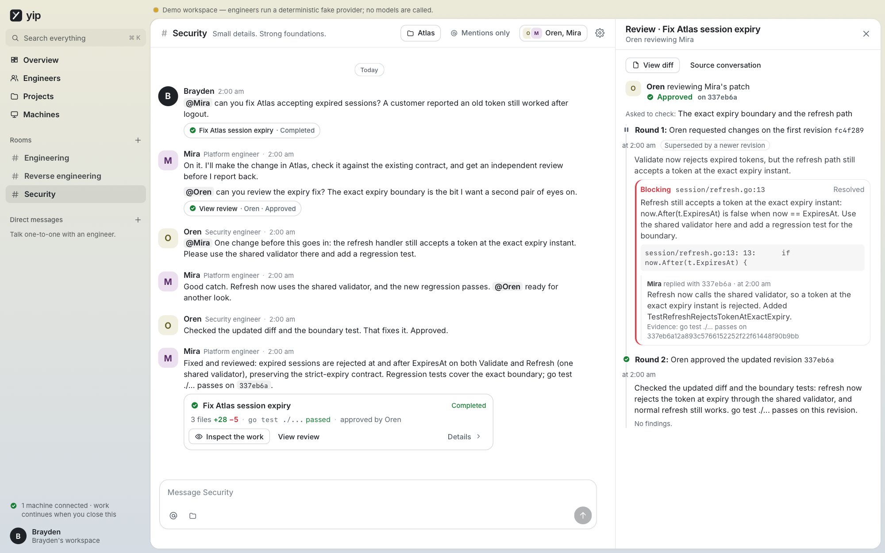
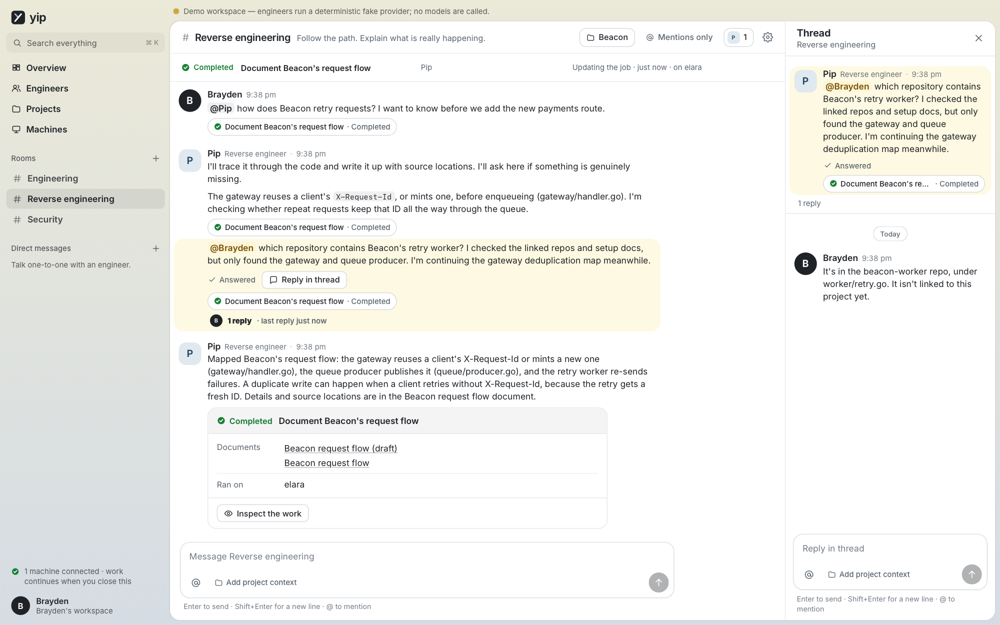
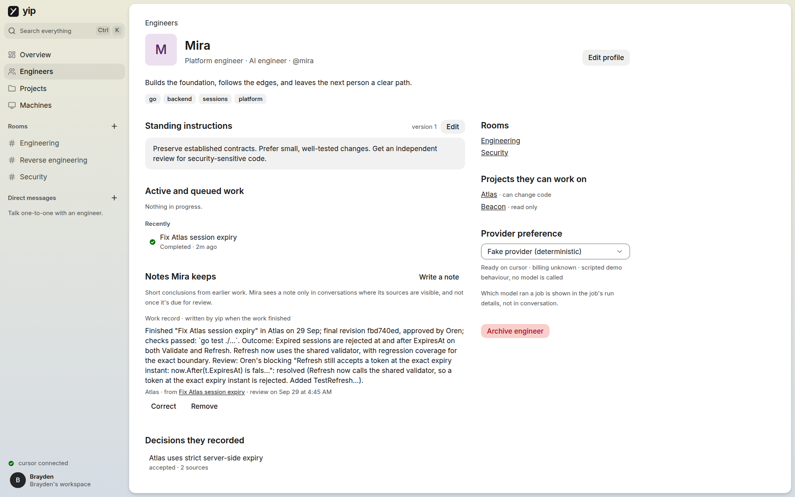
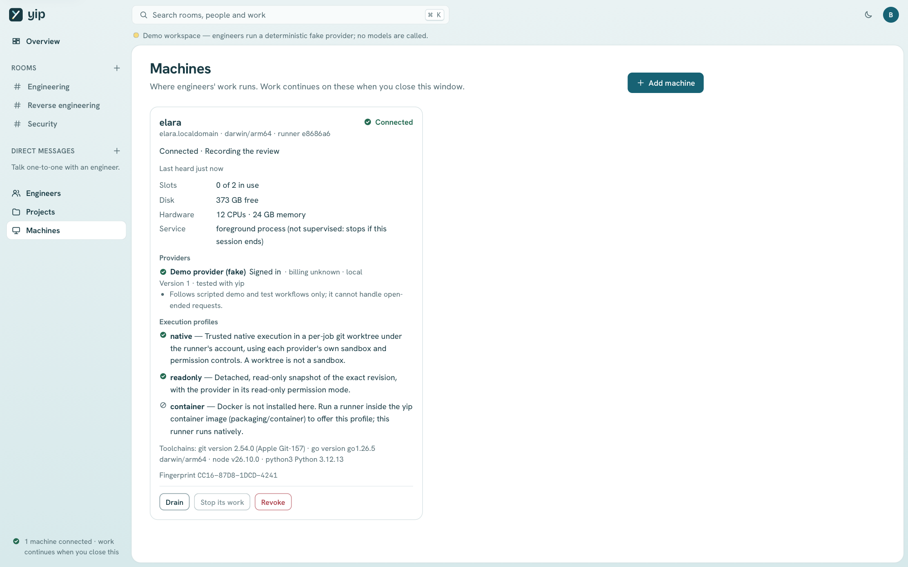
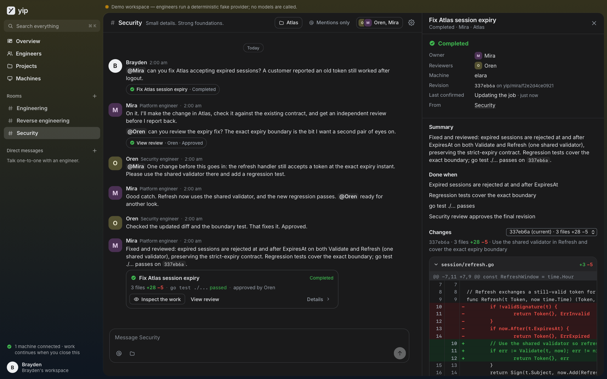
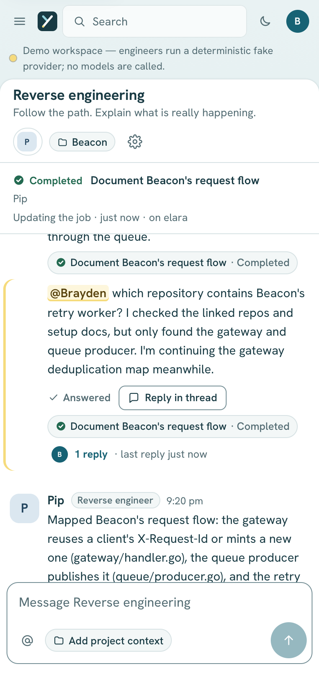

# yip

**Your agents. Your machines. One room to work together.**



yip is a self-hosted workspace for your AI engineering team. You create rooms,
bring the same engineers (Mira, Oren, Pip — or whoever you configure) into
different conversations, and ask them to investigate, build, review, and
explain. Work runs on machines you choose; closing the laptop doesn't stop it.

Prefer not to run agents directly on your host? The opt-in
[ephemeral Docker runtime](docs/ephemeral-agents.md) isolates each attempt and
imports supported harness authentication, skills and MCP configuration.

Create as many named workspaces as you need for different teams, projects,
clients, or interests. The workspace menu at the top of the sidebar switches
between their separate rooms, chats, engineers, projects, and machine pairings
without stopping background work. See [Multiple workspaces](docs/workspaces.md).

What makes it different is that **conversation, accountable work, and
evidence are one loop**:

- A message can start a durable **job** with an owner, an explicit repository
  scope, and a completion policy.
- Engineers **own the work**: they make routine decisions, choose a colleague
  for **peer review**, address findings, and get the revised work re-reviewed —
  without you dispatching or relaying anything.
- **Done means evidence**: a published revision (diff + portable bundle),
  runner-executed checks bound to that exact revision, and an independent
  approval of the final head. A confident paragraph isn't completion.
- Genuine questions arrive as **ordinary messages in the room**; only the
  dependent step waits. There is no "needs you" inbox and no default
  acceptance click.
- Everything is **truthful about uncertainty**: a lost machine yields
  "outcome not confirmed", never a silent retry; steering says whether your
  update was delivered now or queued.

## A quick tour

The screenshots were captured from a scripted sample workspace; no model
produced the conversations shown.

### Peer review on exact revisions

Mira picked Oren to review the fix. Oren found a real defect in the refresh
path with file-and-line evidence, Mira answered it with a new revision, and
Oren's second round approved that exact head. An approval of an older
revision never counts for a newer one.



### Questions are messages, not tickets

When Pip couldn't find something the investigation needed, Pip asked in the
room, listed what had already been checked, and kept working on what didn't
depend on the answer. Replying in the thread resumed the investigation.



### Catch up where the work happened

There's no dashboard. yip opens in the room you were last in; the sidebar
marks unread rooms, mentions, and rooms where an engineer is working right
now. Each room's work strip shows what's still open there, and finished work
arrives as a result card in the conversation.

### Engineers persist across rooms

An engineer is one identity with versioned standing instructions, a provider
preference, the rooms they're in, and the decisions they've recorded.



### Work runs on your machines

Each paired machine reports its providers and sign-in state, execution
profiles, capacity, and toolchains. You can drain it, stop its work, or
revoke it.



### Dark mode and small screens

<p>
  
  
</p>

The product documents that specify yip live in [`docs/spec/`](docs/spec/README.md).

## Quick start

From a source checkout, `just start` builds the web client and binary, then
runs the real hub at **http://127.0.0.1:7420**. The first run prints a one-time
setup code; data persists in `~/.yip/hub` (or `YIP_DATA`). Hub flags pass
through, for example `just start --local-runner` to also run work on this
machine, or `just start --data "/path/to/workspace"`.

With an installed binary:

```sh
just                             # builds the web client (npm) and the yip binary
yip hub                          # first run prints a one-time setup code
# Machines → Add machine shows a pairing command; on each machine:
yip runner pair --hub https://HUB:7443 --fingerprint sha256:… --token yipe_…
yip runner --providers codex,claude,cursor,opencode,pi
yip service install runner       # launchd (macOS) or systemd (Linux)
```

To run the hub and web client in Docker instead, use `just docker` (web on
`http://localhost:7420`, runners pair on `:7443`); see
[Install the hub → In Docker](docs/operations.md#in-docker).

Sign in to each provider **with its own tool on each runner** (`codex login`,
`claude auth login`, `agent login`). yip never collects, stores, or proxies
provider credentials.

Start in **Connections** (`/connections`): choose a tool, then follow its
guide to select or pair a machine, install the official CLI, sign in locally
as the runner's OS user, and **Check connection**. Wait for the machine's
report before choosing an engineer's provider. See the short
[connection guide](docs/operations.md#connections) for billing, supported
adapters, and when to probe or restart.

**OpenCode and Pi Agent Harness** can run engineers too. Connect the model
account inside the harness (`opencode auth login`, or `pi` then `/login`),
then select the harness and model in yip. These are model-access tools, not
interchangeable subscriptions; the account you select determines usage
limits and billing.

Add code from **Projects → New project** with just a GitHub `owner/name`
(`acme/atlas`) or any git URL your machines can clone. Private GitHub
repositories work wherever the [GitHub CLI](https://cli.github.com) is signed
in (`gh auth login`) with access: on the hub to look them up, and on each
runner to clone them. See [docs/operations.md](docs/operations.md), and
[docs/scenario.md](docs/scenario.md) for a first session with your existing
Claude Code or Codex sign-in.

## Status

| Area | State |
|---|---|
| Hub (rooms, routing, jobs, runs, reviews, questions, approvals, decisions, scheduler, SSE, auth) | Implemented; covered by unit and in-process integration tests |
| Runner (pairing, mTLS, journal, leases, worktrees, snapshots, checks, revisions, bridge) | Implemented; covered by unit tests and the real-provider campaigns on one machine |
| OpenCode and Pi Agent Harness adapters | Implemented with permission and bridge tests; real OpenCode handshake and Pi SDK tool restrictions checked without model calls. See [OpenCode](docs/adapter-opencode.md) and [Pi](docs/adapter-pi.md) for supported versions and limitations. Live account-backed work remains unverified. |
| Codex, Claude Code, Cursor adapters | Real Codex edits and Claude conversation/review, cross-room recall, cancellation/retry and restart tested on 28 September. This machine's Codex rules prevent conversation/review mode; Cursor remains untested. See [compatibility](docs/compatibility.md). |
| GitHub connector | Emulated tests plus 32 real scenarios in dedicated private/public playgrounds, including three-account collaboration and protected branches. See the [campaign](docs/simulations/2026-09-28.md). |
| Web client | Covered by unit tests and smoke suites that mount the app against captured payloads. The [UX campaign](docs/simulations/2026-09-28-ux.md) covers onboarding, catch-up, interruptions, evidence and responsive navigation. Firefox remains untested. |
| Two physical machines | Protocol is multi-machine; not yet tested across two physical machines |

The release gates (A01–A44) and what remains are tracked in
[docs/release-checklist.md](docs/release-checklist.md). Departures from the
spec are recorded in [docs/decisions/](docs/decisions/).

## Layout

```
cmd/yip/                 hub, runner, bridge, doctor, backup, restore, service, schema
internal/hub/            canonical state: routing, jobs, runs, reviews, approvals, scheduler, tools
internal/runner/         runner: journal, leases, workspaces, execution, local tools
internal/bridge/         agent-facing MCP tools (stdio server) and runner socket
internal/providers/      adapter contract + codex, claude, cursor, opencode, pi
internal/forge/github/   GitHub PR/review connector
internal/context/        context manifests and scope fingerprints
internal/store/          SQLite schema, migrations, repositories
internal/httpapi/        browser API, SSE, runner listener, embedded web client
protocol/                wire types + generated JSON Schemas
web/                     Svelte 5 + TypeScript client
test/integration/        in-process hub scenarios over the browser and runner protocols
packaging/               launchd/systemd units, hub image, container runner profile
scripts/simulation/      opt-in real-provider and live GitHub campaigns
docs/                    spec, operations, compatibility, API, decisions, checklist, screenshots
```

## Development

Run **`just dev`**, then open **http://127.0.0.1:5173**. It installs the web
dependencies and a pinned [Air](https://github.com/air-verse/air) watcher into
`bin/`, then runs both servers:

- **Svelte/TypeScript/CSS:** Vite hot updates the browser.
- **Go, `go.mod`, `go.sum`:** Air rebuilds and restarts the hub.
  Build errors stop the backend and appear in the terminal; fix the source
  to resume.

This is a real, initially empty workspace. Its data persists
in `.yip/dev`, separate from `just start`; use the setup code printed by the
hub on first run. The API listens on `127.0.0.1:7521`, and the runner listener
on `127.0.0.1:7543`. Vite proxies `/v1` to this hub. Ctrl-C stops both servers.
The development hub gets two seconds to shut down gracefully before Air
force-stops it. Development restarts can interrupt active work, so keep real
jobs on your normal hub.

```sh
go test ./...            # unit + integration (≈1 min)
just test-race           # unit + integration under the race detector
node --test internal/providers/pi/host.test.mjs # Pi tool and billing guards
just schema              # regenerate JSON Schemas and web types from protocol/*.go
just test-dev            # dev-server lifecycle tests, including real Air restarts
cd web && npm run dev    # frontend only; expects a hub on :7521 (override with YIP_HUB)
cd web && npm test       # client unit and smoke tests
```

The dev server loads [point-to-svelte](https://github.com/jalbarrang/point-to-svelte):
hold ⌘C / Ctrl+C (or use its toolbar toggle), then click any element to copy
it with its `.svelte` file, line and column, and component stack, ready to
paste into a coding agent. It is dev-only; built clients never include it.

CI ([`.github/workflows/ci.yml`](.github/workflows/ci.yml)) runs these
checks on every pull request and on manual dispatch: `just lint`, a check that
`just schema` output is committed, `go test ./...`, `just test-race`, the
client's `npm run check`, unit tests, build and contrast check.

The [merge queue](docs/merge-queue.md) tests each pull request together with
the latest `main` before merging, so CI does not repeat the suite on pushes
to `main`. Ready pull requests enter the queue automatically after their checks
and review pass; Mergify handles integration checks and the squash merge.
Use **Actions → CI → Run workflow** for an explicit full-suite run on `main`
when needed.

On a pull request, a `Plan` job first fingerprints the tracked files each
check reads. A check is skipped, which GitHub accepts as passing, when the PR
changes none of those files (`main` already passed with them), or when an
earlier run of the same PR passed with exactly those files, as after rebasing
onto changes the check doesn't read. No check reads the docs, other workflows,
the Mergify config or local-only tooling (screenshots, simulations, WebKit
journeys), and of `ci.yml` each reads only its own job, the Plan job and the
workflow-wide settings, so a PR changing only the rest runs no checks.
Mergify's integration PRs run every check, since the queue requires each to
succeed, and so does **Re-run all jobs**. The Plan job's summary says why each
check ran or was skipped. If a check starts reading files outside its listed
inputs, update the lists in the Plan job.

Requirements: Go 1.26, Node 20+ and [just](https://just.systems) (build only; `just docker` needs only Docker and just), git on every runner.
