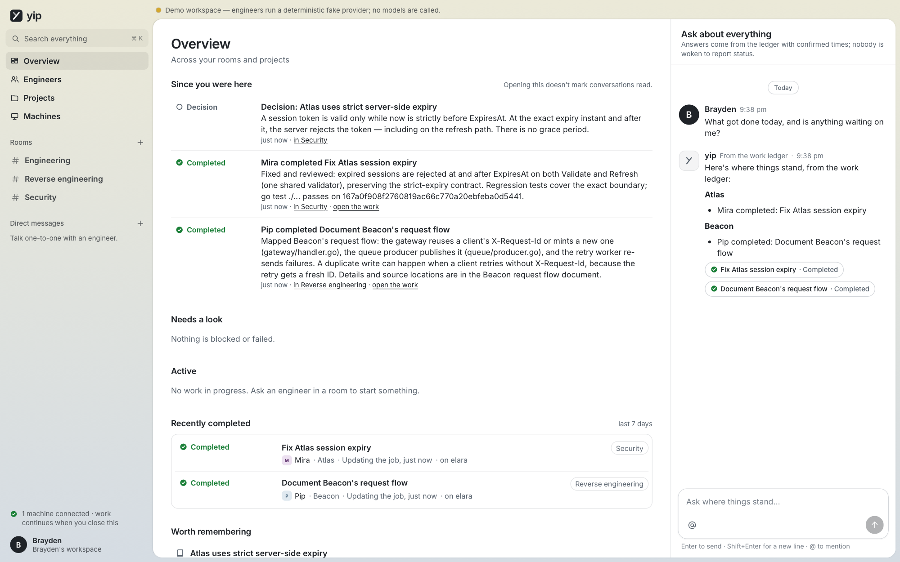

# yip

**Your agents. Your machines. One room to work together.**


yip is a self-hosted workspace for your AI engineering team. You create rooms,
bring the same engineers (Mira, Oren, Pip — or whoever you configure) into
different conversations, and ask them to investigate, build, review, and
explain. Work runs on machines you choose; closing the laptop doesn't stop it.

What makes it different is that **conversation, accountable work, and
evidence are one loop**:

- A message can start a durable **job** with an owner, an explicit repository
  scope, and a completion policy.
- Engineers **own the work**: they make routine decisions, choose a colleague
  for **peer review**, address findings, and get the revised work re-reviewed —
  without you dispatching or relaying anything.
- **Done means evidence**: a published revision (diff + portable bundle),
  runner-executed checks bound to that exact revision, and an independent
  approval of the final head. A confident paragraph isn't completion.
- Genuine questions arrive as **ordinary messages in the room**; only the
  dependent step waits. There is no "needs you" inbox and no default
  acceptance click.
- Everything is **truthful about uncertainty**: a lost machine yields
  "outcome not confirmed", never a silent retry; steering says whether your
  update was delivered now or queued.

## A quick tour

The screenshots show the demo workspace, where engineers run on yip's
deterministic fake provider — no model is called, and each engineer's
provider preference says so.

### Peer review on exact revisions

Mira picked Oren to review the fix. Oren found a real defect in the refresh
path with file-and-line evidence, Mira answered it with a new revision, and
Oren's second round approved that exact head. An approval of an older
revision never counts for a newer one.


### Questions are messages, not tickets

When Pip couldn't find something the investigation needed, Pip asked in the
room, listed what had already been checked, and kept working on what didn't
depend on the answer. Replying in the thread resumed the investigation.


### Catch up without waking anyone

The Overview summarises what happened since you were last here and stays
current while work moves through review and completion. Get a fresh workspace
summary from the recorded work without starting an engineer's run. Ask an
engineer in a conversation for an open-ended answer.



### Engineers persist across rooms

An engineer is one identity with versioned standing instructions, a provider
preference, the rooms they're in, and the decisions they've recorded.


### Work runs on your machines

Each paired machine reports its providers and sign-in state, execution
profiles, capacity, and toolchains. You can drain it, stop its work, or
revoke it.


### Dark mode and small screens

<p>
  
  
</p>

The product documents that specify yip live in [`docs/spec/`](docs/spec/README.md).

## Quick start (demo)

The demo seeds a workspace whose engineers run on yip's **deterministic fake
provider** — no model is called, and the UI says so. It exercises the whole
pipeline: hub, runner over mutual TLS, git worktrees, the MCP bridge, reviews,
questions, steering, and recovery.

```sh
just            # builds the web client (npm) and the yip binary
./bin/yip demo  # prints the URL and demo credentials
```

Then, in **Security**, send `@Mira can you fix Atlas accepting expired
sessions?` and watch Mira fix it, pick Oren to review, get a real defect found
in the refresh path, fix that, and complete after re-review. In **Reverse
engineering**, ask `@Pip how does Beacon retry requests?` to see a genuine
question in the room and a resumed job after you reply in its thread.

## Real use

```sh
yip hub                          # first run prints a one-time setup code
# Machines → Add machine shows a pairing command; on each machine:
yip runner pair --hub https://HUB:7443 --fingerprint sha256:… --token yipe_…
yip runner --providers codex,claude,cursor
yip service install runner       # launchd (macOS) or systemd (Linux)
```

To run the hub and web client in Docker instead, use `just docker` (web on
`http://localhost:7420`, runners pair on `:7443`); see
[Install the hub → In Docker](docs/operations.md#in-docker).

Sign in to each provider **with its own tool on each runner** (`codex login`,
`claude auth login`, `agent login`). yip never collects, stores, or proxies
provider credentials.

Add code from **Projects → New project** with just a GitHub `owner/name`
(`acme/atlas`) or any git URL your machines can clone. Private GitHub
repositories work wherever the [GitHub CLI](https://cli.github.com) is signed
in (`gh auth login`) with access: on the hub to look them up, and on each
runner to clone them. See [docs/operations.md](docs/operations.md), and
[docs/scenario.md](docs/scenario.md) for a first session with your existing
Claude Code or Codex sign-in.

## Status

| Area | State |
|---|---|
| Hub (rooms, routing, jobs, runs, reviews, questions, approvals, decisions, scheduler, SSE, auth) | Implemented; covered by unit and in-process integration tests |
| Runner (pairing, mTLS, journal, leases, worktrees, snapshots, checks, revisions, bridge) | Implemented; exercised by the integration suite on one machine |
| Deterministic fake provider | Implemented (demo + failure injection) |
| Codex, Claude Code, Cursor adapters | Real Codex edits and Claude conversation/review, cross-room recall, cancellation/retry and restart tested on 28 September. This machine's Codex rules prevent conversation/review mode; Cursor remains untested. See [compatibility](docs/compatibility.md). |
| GitHub connector | Emulated tests plus 32 real scenarios in dedicated private/public playgrounds, including three-account collaboration and protected branches. See the [campaign](docs/simulations/2026-09-28.md). |
| Web client | System WebKit and installed Chrome journeys passed. The [UX campaign](docs/simulations/2026-09-28-ux.md) covers onboarding, catch-up, interruptions, evidence and responsive navigation. Firefox remains untested. |
| Two physical machines | Protocol is multi-machine; tested with one hub and one runner per test on a single host |

The release gates (A01–A44) and what remains are tracked in
[docs/release-checklist.md](docs/release-checklist.md). Departures from the
spec are recorded in [docs/decisions/](docs/decisions/).

## Layout

```
cmd/yip/                 hub, runner, bridge, doctor, backup, restore, service, schema
internal/hub/            canonical state: routing, jobs, runs, reviews, approvals, scheduler, tools
internal/runner/         runner: journal, leases, workspaces, execution, local tools
internal/bridge/         agent-facing MCP tools (stdio server) and runner socket
internal/providers/      adapter contract + codex, claude, cursor, fake
internal/forge/github/   GitHub PR/review connector
internal/context/        context manifests and scope fingerprints
internal/store/          SQLite schema, migrations, repositories
internal/httpapi/        browser API, SSE, runner listener, embedded web client
protocol/                wire types + generated JSON Schemas
web/                     Svelte 5 + TypeScript client
test/integration/        hub + runner + bridge + fake provider scenarios
packaging/               launchd/systemd units, hub image, container runner profile
scripts/screenshots/     demo scenario + WebKit capture for the README images
docs/                    spec, operations, compatibility, API, decisions, checklist, screenshots
```

## Development

```sh
go test ./...            # unit + integration (≈1 min)
go test -race ./internal/... ./test/integration/
just schema              # regenerate JSON Schemas and web types from protocol/*.go
cd web && npm run dev    # client dev server (proxy /v1 to a running hub)
cd web && npm test       # client unit and smoke tests
```

The dev server loads [point-to-svelte](https://github.com/jalbarrang/point-to-svelte):
hold ⌘C / Ctrl+C (or use its toolbar toggle), then click any element to copy
it with its `.svelte` file, line and column, and component stack, ready to
paste into a coding agent. It is dev-only; built clients never include it.

CI ([`.github/workflows/ci.yml`](.github/workflows/ci.yml)) runs the same
checks on every pull request and push to `main`: `just lint`, a check that
`just schema` output is committed, `go test ./...`, `go test -race
./internal/...`, the client's `npm run check`, unit tests, build and contrast
check, and the browser journeys (`npm run e2e`) in Chromium.

To try it on a phone or another computer while developing, `just lan` serves
the demo on your local network (built app on :7721, live-reload client on
:5173; plain HTTP, demo data only).

To refresh the screenshots, start a fresh demo and run the capture script. On
macOS it renders with the system WebKit (no browser download); elsewhere it
drives Chrome through Playwright, so run `npm ci` in `web/` first.

```sh
./bin/yip demo --reset --data /tmp/yip-demo-shots --listen 127.0.0.1:7821 --runner-listen 127.0.0.1:7844
python3 scripts/screenshots/capture.py --credentials /tmp/yip-demo-shots/demo-credentials.txt
```

Requirements: Go 1.26, Node 20+ and [just](https://just.systems) (build only; `just docker` needs only Docker and just), git on every runner.
