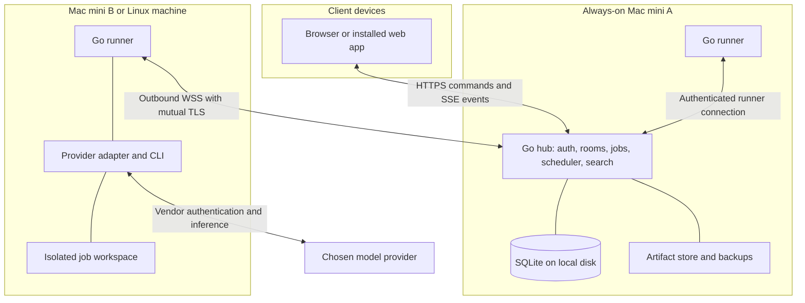

# yip · Solution architecture

Version 1.2 · 25 September 2026 · Proposed architecture, not a description of deployed software

Working name: **yip**. The possible domain is `getyip.dev`; see the dated naming checks in the research appendix.

## 1. The system we are building

yip provides a persistent organisation of AI engineers that people can address in shared rooms. An engineer is an enduring identity with a role, configuration, permitted knowledge, and work history. It is **not** a permanently running model process, a single conversation window, or a Docker container. Execution processes start when work needs them and may be replaced without replacing the engineer.

The primary deployment is one person, a laptop used as a client, and several always-on computers doing the work. A single machine can host everything. A larger deployment can later add human members without changing the identity or work model.

The core separation is:

| Object | Meaning | Lifetime |
|---|---|---|
| Engineer | Who you work with | Until archived by the owner |
| Room | Where a group talks | Independent of any one project |
| Thread | One conversation within a room | Durable, searchable history |
| Project | Repositories, instructions, and access policy | Across rooms and jobs |
| Job | An accountable request with an owner and result | Until completed under its policy, cancelled, or abandoned |
| Run | One execution attempt for a job or conversational response | Bounded attempt |
| Provider session | Vendor-specific context for an engineer in one permitted scope | Resumable only when compatible |
| Machine | A registered runner with execution capabilities | Until revoked |

An engineer may belong to many rooms. A room may discuss many projects. A job may span projects, but each editing run has exactly one repository workspace; multi-repository work uses linked child jobs and a parent result. This prevents ambiguous working directories.

## 2. Product invariants

1. The hub owns canonical state. No laptop tab owns a job's lifetime.
2. Every dispatched unit of work has a persisted run ID, immutable reply destination, engineer identity, scope, and parent cause.
3. A claim in chat is not authoritative job state. State changes pass through validated hub operations.
4. One active owner holds a job lease. Contributors have explicit child jobs or review requests.
5. Membership grants conversation access, not repository write access or credentials.
6. Agent messages do not indiscriminately wake other agents. Wakeups have a purpose, recipient, and bounded causal chain.
7. A provider change preserves identity and approved knowledge, not imaginary continuity of a vendor's hidden session.
8. An interrupted external write is not automatically replayed. Unknown outcomes remain visibly unknown until reconciled.
9. Provider secrets remain under the provider's supported credential management on the executing machine. The hub never harvests login files or proxies a subscription token into a different API.
10. No merge, deployment, remote push, or outgoing third-party communication is implied merely by a successful code-generation run. Project policy or a specific user instruction must authorize it.

11. Engineers make routine decisions and complete authorized work autonomously. Genuine questions go in the source room/thread; only dependent work waits. Human acceptance is required only by an explicit task or project policy.

12. An engineer can independently request a peer review of work or a pull request, receive substantive feedback, revise, and request another review. Review conclusions bind to immutable revisions; internal peer approval and forge merge eligibility remain separate facts.

## 3. Deployment and component boundaries

**Hub:** serves the UI; authenticates people and machines; stores messages and work; resolves room routing; builds bounded context manifests; dispatches jobs; checks permissions; manages approvals and artifacts; exposes search. It is ordinary application software, not a model playing CEO. Semantic interpretation happens through an explicitly chosen engineer.

**Runner:** advertises its OS, architecture, available providers, toolchains, execution profiles, free capacity, and project replicas. It creates workspaces, supervises process groups, renews leases, journals output, executes provider adapters, and returns events and artifacts. It never makes organisation-level authorization decisions.

**Provider adapter:** converts vendor-specific events into the internal run event contract and supports capability discovery, start, input, cancel, approval, and resume where available. Vendor IDs remain opaque, namespaced values.

**Client:** renders history, live progress, room questions, and artifacts. It can disconnect freely. On reconnect it gets canonical state, reconciles optimistic messages, and replays events after its cursor.

**MCP bridge:** the runner exposes narrowly scoped yip tools to an agent through local stdio. Each invocation is bound to the run's authority. The model cannot choose its author identity or widen its grants by supplying a different ID.

### Placement on the user's machines

- Mac mini A: hub, database, artifacts, backup scheduler; optionally a runner with a small capacity allocation.
- Mac mini B and additional machines: runners, provider installations, repository replicas, native or container execution.
- Laptop: web client by default. Adding its runner is optional, with scheduling disabled unless explicitly enabled.
- Phone: responsive web client for reading, steering, and approvals. No requirement for a mobile app in the MVP.

Closing the laptop leaves remote runs unaffected. Powering off the hub does affect scheduling and approvals: there is no hidden cloud failover. Machine sleep and reboot behaviour must be tested during setup. macOS login-keychain dependencies and FileVault boot unlock can prevent unattended recovery after reboot; show the actual tested service state rather than promising unconditional uptime.

## 4. Technology decisions

| Area | Choice | Why it fits | Alternatives and tradeoffs |
|---|---|---|---|
| Hub and runner | Go, supported stable release pinned at implementation | Native executables, process supervision, networking, straightforward service distribution | Rust is viable but adds ownership/async complexity without a demonstrated requirement. Node is capable, but introduces a runtime into every execution host. |
| Web UI | Svelte 5, TypeScript, Vite; SPA embedded with Go `embed` | Reactive streaming chat, composer state, drawers, accessible components, little application ceremony | Vanilla DOM code would recreate a state/component framework. HTMX suits simpler pages; these simultaneous interactive surfaces need substantial client state. React works but is not necessary. No SSR requirement. |
| Components | Headless accessible Svelte primitives where helpful; custom visual system | Reuse focus/menu/dialog behaviour without inheriting a generic visual theme | Audit accessibility and maintenance before pinning a library. Do not build a design around a component catalogue. |
| Database | SQLite WAL through a pinned Go driver such as `modernc.org/sqlite`; explicit SQL migrations | One hub writer and portable personal deployment; transactional work queue and search in one store | Postgres becomes sensible for high availability or measured write contention. Do not implement two databases now. |
| Search | SQLite FTS5 plus structured filters | Messages, job titles, decisions, evidence metadata | Embeddings are optional later. Correct access filtering and explicit project links come first. |
| Browser transport | HTTP JSON mutations; SSE for events | Simple requests and resumable streaming; no persistent browser command channel needed | WebSocket useful for the runner's bidirectional control, not required for browser chat. |
| Runner transport | Product-owned versioned protocol over WSS/mTLS | Outbound connection, bidirectional control, node identity | SSH can install or diagnose; it is not the runtime event bus. |
| Scheduling | Transactional DB queue, leases, outbox, in-process dispatcher | All required consistency stays in the hub transaction | No Redis, Kafka, NATS, Kubernetes, or workflow engine until a measured need exists. |
| Artifacts | Content-addressed files on hub-local disk | Small operational footprint and verifiable transfer | S3-compatible storage later through a storage interface. |
| Execution | Native runner profiles plus optional Linux containers | Native macOS toolchains when needed; Linux isolation for suitable jobs | Containers on macOS use a VM and do not run native Xcode workloads. |
| Packaging | Signed/checksummed hub and runner releases; native service installation; optional hub container | Simple personal operation | Tauri shell is a later packaging choice, not a prerequisite for laptop-independent execution. |

Svelte's compiler-oriented approach is documented in its [overview](https://svelte.dev/docs/svelte/overview). SQLite WAL permits concurrent readers with a writer, but its database must remain on one host; runners must **never mount the hub database over a network filesystem**. See [SQLite WAL](https://sqlite.org/wal.html), [Go driver documentation](https://pkg.go.dev/modernc.org/sqlite), and [Docker VM documentation](https://docs.docker.com/desktop/features/vmm/). These choices are architectural judgments, not performance benchmarks.

## 5. Provider integrations and subscriptions

Treat authentication, capabilities, billing, and session portability separately. Discover the installed version and model catalogue; do not hardcode whatever model was fashionable when this document was written. Store the selected provider and model on every run.

| Provider route | Proposed adapter | Account path | Release gate |
|---|---|---|---|
| Codex | Local app-server over stdio | Codex-managed ChatGPT sign-in/device flow or user API key | Streaming, approval, interruption, restart/resume, and account-limit handling on a pinned version |
| Claude Code | Unmodified CLI subprocess, structured streaming output, explicit session resume, supported permission bridge | User signs in through Anthropic's own Claude Code flow on the runner | Native CLI authentication, scoped tools, approval round trip, session recovery; no token extraction |
| Claude Agent SDK | Optional separate API-backed adapter | User API key or supported cloud provider | Do not present subscription OAuth as this adapter's authentication |
| Cursor | Native `agent acp` over stdio | Vendor login on runner or Cursor user API key | ACP permissions, question/plan requests, cancellation, resume, model discovery, and billing labels |
| Other harnesses | ACP adapter after conformance test | Whatever the vendor supports | Advertise actual negotiated capabilities; no universal compatibility promise |

Codex documents app-server for custom clients, including authentication, events, and approvals. Use its local transport inside the runner; its remote WebSocket surface is marked experimental. Generate protocol bindings from the pinned executable. [Official Codex app-server documentation](https://learn.chatgpt.com/docs/app-server)

Anthropic's current guidance distinguishes users signing into an unmodified Claude Code binary from third-party apps collecting credentials or offering Claude.ai login through the SDK. Implement the former as a user-controlled CLI integration and the SDK route with API authentication. Distribution must satisfy the provider's stated conditions; do not convert either into a shared credential pool. [Claude Code integration and credential guidance](https://code.claude.com/docs/en/legal-and-compliance), [Agent SDK overview](https://code.claude.com/docs/en/agent-sdk/overview)

Cursor documents ACP for custom clients, including permission requests, session loading, and additional blocking question/plan methods. Reply to every supported blocking request or fail visibly; never leave a hidden prompt hanging. [Cursor ACP](https://cursor.com/docs/cli/acp), [Cursor authentication](https://cursor.com/docs/cli/reference/authentication)

### Adapter policy

- Supported interfaces only. No scraping terminal escape sequences when structured events are available; no browser-login automation or spoofed clients.
- A profile describes account ownership and which machine installations belong to the same quota pool. Multiple engineers using one account do not create more allowance. Default shared-account concurrency is one until the user raises it.
- Display `subscription`, `API billed`, or `billing unknown`; show vendor-provided usage when available. Never turn missing telemetry into “free” or an invented dollar estimate.
- No automatic paid fallback. At a limit, persist the job as waiting and present “Wait for allowance” or a named, explicitly configured alternative.
- Authenticate separately through the vendor on each eligible runner. A machine without the required account/profile is not a fallback target.
- Track capabilities such as structured events, tool approvals, user questions, session resume, active steering, usage telemetry, sandboxing, and model enumeration. Unsupported functions disappear or explain their limitation.
- If a process cannot enforce the required permission boundary, refuse that execution profile; do not silently run it unrestricted.

## 6. Durable data model

All records carry an organisation ID, stable ID, creation timestamp, and a version where mutable. UUIDv7 is a suitable application ID; a hub-issued increasing event sequence determines replay order. Client clocks never determine message ordering.

| Tables | Essential fields and constraints |
|---|---|
| `orgs`, `users`, `sessions` | Owner, local authentication hash, session expiry/revocation. Start with one human owner. |
| `engineers`, `engineer_versions` | Name, role, instructions, capability tags, provider profile preference, policy, archive flag; immutable config snapshots per run. |
| `rooms`, `room_memberships`, `threads` | Room purpose, reply mode, steward engineer, grants; unique member per room; immutable thread origin. |
| `projects`, `repos`, `project_grants`, `room_projects` | Explicit project scope and repository access. Room/project is many-to-many. |
| `messages`, `message_revisions`, `mentions` | Author type/ID, room/thread, structured mention IDs, body, originating run, visibility, client idempotency key. |
| `jobs`, `job_dependencies`, `job_assignments` | Objective, acceptance criteria, completion policy, one owner, contributor links, project IDs, state, policy version, source message. Reject dependency cycles. |
| `runs`, `run_events`, `provider_sessions` | Attempt number, lease epoch, node, heartbeat, provider IDs, context manifest, worktree reference, immutable destination, terminal outcome. |
| `reviews`, `review_rounds`, `review_findings` | Author and distinct reviewer engineer IDs, source room/thread, target kind and artifact hash or repository/base/head revisions, criteria, round, verdict, findings with file/line evidence, resolution replies, and supersession. A changed target requires a new review round. |
| `pull_requests`, `forge_deliveries` | Forge host/repository/PR identity, canonical URL, current base/head, remote actor and grants, external review/comment IDs, check/merge state, last synchronization, deduplication keys. |
| `approvals` | Run, exact action/arguments digest, scope, target revision, expiry, requester, decision and decision-maker. Single-use consumption. |
| `questions` | Source room/thread/message, asker, permitted recipient, missing fact, context already checked, dependent step/job, status, and answer message ID. Ordinary room replies resolve questions; no separate attention inbox or arbitrary answer deadline. |
| `nodes`, `node_capabilities`, `provider_installations` | Paired identity, revocation, last seen, capacity, installed versions, account/profile label. No provider tokens. |
| `artifacts`, `artifact_links`, `checkpoints` | Hash, content type, size, origin run, access scope, retained workspace state. |
| `memories`, `decisions`, `memory_sources` | Scope, content, provenance, validity, superseded version, creator, review status. |
| `events`, `outbox`, `deliveries` | Transactional application events and durable delivery bookkeeping. Unique producer event key. |
| `audit_entries`, `usage_samples` | Actor, authority, action, target, result; reported usage and its source, including explicit unknown values. |

Use foreign keys and indexes on room/message sequence, job/state, run/node, due queue items, and scope-filtered search. Store large logs and files outside SQLite; small event records reference them. JSON fields are appropriate for vendor payloads and versioned manifests, not a replacement for important relational constraints.

### Transaction rule

Persist each mutation, its event, and any dispatch outbox item in one DB transaction. The dispatcher sends only committed outbox rows. A crash after commit but before delivery causes replay, not a lost job. Unique keys make duplicate delivery harmless at the hub and runner boundaries.

Do not build a fully event-sourced application. Relational rows are current state; the append-oriented event stream supports replay, debugging, and audit. Sensitive-content deletion must redact materialized content, search, and retained event payloads according to policy; an audit tombstone does not need to retain deleted message text.

## 7. Conversation and collaboration engine

### Human messages

1. Validate access; persist the message and structured mentions.
2. Resolve explicit recipients first. In a thread, an unaddressed follow-up goes to its owner; in a general room, it goes to that room's chosen steward. A quiet room only wakes explicitly mentioned engineers.
3. The recipient interprets whether the message asks for an answer, investigation, or implementation. A simple answer needs a bounded conversational run. Work needing tools or follow-through creates a job through the bridge.
4. Show a compact acknowledgement with the interpreted scope and owner. Ordinary authorized work starts immediately. Resolve routine uncertainty from project instructions, existing behaviour, evidence, and colleagues. Make reasonable reversible decisions within scope, recording consequential assumptions. Ask only when a necessary fact, constraint, or authority genuinely cannot be resolved.
5. An explicit request to several engineers creates a shared job with named contributor work, rather than several independent implementations of the same request.

Structured mentions come from the composer or a validated tool call. Text inside code, quoted material, fetched pages, or tool output must not become a command or wakeup just because it contains `@Mira`.

### Engineer-to-engineer communication

Agents may post observations, ask a named colleague a question, request review, or delegate a bounded child job. These operations are readable in the same thread. The hub grants a recipient a reply opportunity tied to the request. A factual update is visible but does not wake the whole room. A direct reply resolves its pending request; “thanks” creates no new work.

`request_help` records expected output, recipient, due/stale policy, and an evidence pointer. It releases the caller's inference slot while waiting. This avoids a parent occupying the only slot while its child waits in the queue. The hub checks dependency cycles before admitting a blocking wait.

The room steward is an ordinary chosen engineer, replaceable or absent in quiet mode. It has no special write authority. The hub handles routing, not creative engineering decisions. Do not create a compulsory CEO model or wake a model merely to report a known queue state.

### Peer review as ordinary engineering work

The engineer who owns the work chooses a suitable permitted colleague by expertise, project familiarity, and current workload. A human need not assign or relay the review. Use a distinct engineer identity and a fresh, scoped reviewer context; changing provider/model is optional and is not proof of independence. Review access never silently expands room or repository permissions. If the best colleague is busy, queue the review or choose another qualified permitted colleague and continue independent work.

A request includes the original objective, constraints, an immutable patch/document/artifact, checks already run, and any specific concern. Reviews work before a PR exists and on existing PRs. The reviewer inspects the underlying work and relevant surrounding context, verifies important claims, and distinguishes a blocking defect from a suggestion. Reviewers can disagree; they must explain the evidence. Missing access or unrun checks produces a qualified result, never fabricated approval. A reviewer uses its own read-only snapshot; suggested fixes return to the author rather than editing the author's live worktree.

The conversational request and its structured review record are one logical action with a shared cause/idempotency key. Posting the mention, mirroring it to a PR, or replaying delivery must not dispatch the reviewer twice.

Review round states: `requested → queued → reviewing → approved | changes_requested | comments_only | unable_to_review | cancelled`. A new target revision supersedes the old round's applicability. `changes_requested` creates concrete author follow-up; the author implements a fix or responds with evidence, then requests re-review. Only the reviewer resolves a disputed blocking finding. `comments_only` does not satisfy a required approval. A required review is complete only when the current revision is approved, blocking findings are resolved, and checks satisfy the job policy. Peer approval can complete authorized work without human acceptance. If the objective includes merging, the job remains incomplete until the permitted merge actually succeeds.

Use at most three substantive review rounds by default, within the root request's existing wakeup budget. Repeated unchanged objections do not cause infinite ping-pong. The author and reviewer consolidate the remaining disagreement; another qualified colleague may arbitrate within available authority/budget. Ask the human in the source room only when a real unresolved product constraint or decision requires them. Other independent work continues.

### Pull request integration

Implement a GitHub connector as the first forge integration, behind a forge-neutral contract. It reads the PR diff at an exact revision, relevant files, review threads, and checks; it can publish attributed findings and review outcomes when the project's existing grants cover that repository and action. A chat request addressed to Oren dispatches the internal engineer; it does not automatically request a review from an unrelated GitHub user or team. External publication, remote reviewer notifications, pushes, and merges each use their actual authorization and granted credential. Opening an internal review never requires public posting.

Record both the engineer who did the review and the authenticated forge actor. Several engineers sharing one GitHub credential are not several GitHub reviewers. GitHub does not allow an author to approve their own pull request; therefore an internal approval cannot be presented as satisfying a GitHub branch rule when the credential is ineligible. Surface “Oren approved this revision” separately from actual remote review and merge status. Never invent GitHub identities or count attribution text as an independent platform approval. [GitHub review behaviour](https://docs.github.com/en/pull-requests/how-tos/review-pull-requests/reviewing-proposed-changes-in-a-pull-request)

Pin every review to the recorded base/head pair. New commits invalidate the workspace's current-review status and schedule a review of the new snapshot; old comments remain linked to their old lines/revision. Immediately before publishing a verdict, re-fetch the target and verify it still matches; if the PR changes during publication, retain the old-revision verdict as stale and queue the new review. Reconcile signed webhook events, deduplicate retries, and use bounded polling when webhooks are unavailable. Reads and writes preserve conversation visibility; private-room findings cannot be published into a broader PR without an authorized sharing boundary. After ambiguous publication failures, reconcile external IDs before retrying to avoid duplicate reviews. [Review API](https://docs.github.com/en/rest/pulls/reviews), [review-request API](https://docs.github.com/en/rest/pulls/review-requests)

Merge eligibility is read from the forge's current protections/checks as well as local policy. Approval does not itself grant merge permission. A passed review can trigger an already-authorized merge only when all real requirements pass. Preserve pending checks, dismissed reviews, closed PRs, unavailable credentials, and denied writes as distinct facts.

### Loop and noise controls

Every wakeup has a root human request, cause ID, and unique delivery ID. Initial defaults: one active run per engineer; at most four active runs per organisation, further bounded by machines and account profiles; maximum three delegation levels; maximum twelve automatic agent-to-agent wakeups per root request. Reaching the limit stops additional delegation; it does not manufacture a human approval task. The owner engineer continues permitted independent work within the remaining run budget, or records a truthful limitation and asks in the room only if continuing genuinely requires help. These are adjustable operating bounds, not delivery estimates or guarantees of model cost.

Duplicate producer event keys are discarded. Repeated failed calls with identical normalized arguments stop after the configured retry limit. A no-progress detector proposes a pause; it must not erase work. The user can cancel the whole job tree. Tool logs remain available under Activity, while meaningful collaboration appears in chat.

## 8. Context, memory, and confidentiality

Persist identity in the engineer record. Persist shared decisions in scoped knowledge. Persist provider sessions separately. Do not stuff every room's history into one everlasting prompt.

A run receives a reproducible context manifest: engineer config version, instruction hierarchy, human request, allowed project/repository revisions, selected messages, job facts, relevant memory IDs, and remaining context allowance. Reserve room for tool output and completion; truncate evidence with explicit pointers rather than silently losing the user's constraints.

Context layers:

1. Owner-authored organisation rules and engineer role.
2. Project instructions and accepted project decisions.
3. Room/thread context that this run may both read and discuss here.
4. Current job, dependency outcomes, and selected evidence.
5. A short engineer-specific note, partitioned by project/room visibility.

Search filters permissions **before** retrieval and ranking. Cache keys contain the scope/grants version. Derived notes inherit the intersection of source visibility; they never become organisation-wide merely because an engineer wrote them. Promoting a private finding into a wider room requires an explicit, authorized publication operation. Removing access invalidates relevant cached context and prevents session reuse.

Provider session reuse is keyed by engineer, thread/job context, repository workspace, provider account, and security-scope fingerprint. Reuse only while these boundaries remain compatible. Cross-room conversation uses a fresh session plus permitted facts. This is essential: an engineer who belongs to a private security room must not carry its whole private model transcript into a public planning room.

The same engineer can truthfully say “We decided this in the Atlas review” when that decision is shared and citable. Otherwise it should explain that it cannot bring restricted context into this conversation. Global status also respects destination visibility: the owner's personal Overview may contain more than an ordinary room.

Memories have provenance, correction, expiry/review status, and supersession. Agent-suggested memory is marked as a proposal until accepted or covered by a narrow auto-accept policy. Raw hidden reasoning is neither requested nor stored as shared memory. Store conclusions, evidence, actions, and concise progress.

The initial auto-accept policy permits engineers to record sourced implementation decisions within their existing project authority once required checks or peer review pass. That recording does not require human confirmation. It cannot alter user instructions, widen access, or turn uncertain observations into established facts; those remain explicitly qualified. Memory promotion never creates a default human-input queue.

## 9. Execution lifecycle and recovery

### State machines

Job state: `queued → running → completed | waiting | review_ready | failed | cancelled`; `waiting → queued`; `review_ready → completed | queued`; `failed → queued` only by retry policy or explicit retry. `completed` means evidence and configured checks/reviews satisfy the completion policy, not merely that a model returned text. Peer review can satisfy that policy. Human acceptance is opt-in per project/task; it is not the default final transition. `review_ready` means a required review remains outstanding, with its actual reviewer identified. `waiting_reason` distinguishes missing information, approval, dependency, provider allowance, machine availability, and recovery. An unanswered question defers only its dependent step or child job; the parent remains running while independent work continues. Yield execution capacity when no useful independent work remains.

A genuine human question is an ordinary message in the originating room/thread, with a structured mention, the specific missing information, relevant evidence/attempts, and what continues meanwhile. Persist its correlation ID behind the conversation. A natural reply resolves that question idempotently and resumes only its live dependent work. Duplicate or late replies cannot restart cancelled work. Never infer an answer from silence, repeatedly nag by timer, or mark the entire engineer as “Needs you.”

Permission checks remain enforced. Evaluate existing grants first; authorized routine actions proceed automatically. If additional authority is actually required, show the precise action inline in its source conversation. Provider blocking requests must be explicitly answered through supported adapters: map existing deterministic policy where applicable, have the engineer resolve substantive questions within its remit where supported, or surface a genuine unresolved question. Do not silently bypass provider guarantees or auto-approve from vague text matching.

Run state: `created → offered → preparing → running → awaiting_input | stopping | succeeded | failed | cancelled | unknown`. Runs are attempts. A retry creates a new run linked to the previous one. A lost running machine produces `unknown`, not “failed, safe to repeat.”

### Scheduling

Filter candidates by owner/account profile, project access, required provider capability, OS/toolchain, execution policy, and free capacity. Prefer the existing project replica and session affinity. Schedule fairly across projects with aging; explicit user priority may move work ahead. Reserve memory/CPU budgets and an inference slot separately. Reject an impossible request with its missing requirement instead of leaving it queued forever.

Native-mode CPU and memory readings inform scheduling, but do not promise container-grade resource limits. Container profiles enforce their configured limits. Inference typically happens at the provider; local machines still do builds, tests, browsers, files, and tool execution.

### Leases and fencing

Initial operating defaults: runner heartbeat every 10 seconds; suspect after three missing heartbeats; lease 60 seconds; runner stop margin 10 seconds. Use monotonic elapsed time on the runner; the hub supplies the renewal interval and epoch. On failed renewal, stop admitting tool calls and terminate the provider process group by the safe deadline. If termination cannot be confirmed, retain `unknown` and quarantine that execution identity.

Every mutating run operation carries its run ID and lease epoch. The hub rejects stale epochs, including late artifact publication as the current result. A revoked machine cannot regain authority by replaying its queue. Keep stale output as quarantined diagnostic evidence when appropriate.

A lease cannot undo an email, remote push, or provider request already in flight. External operations need their own operation journal and idempotency key when supported. On ambiguous completion, inspect the external outcome or ask the owner; do not claim exactly-once execution. Scheduler failover alone does not make external side effects safe.

### Failure responses

| Failure | Required behaviour |
|---|---|
| Laptop sleeps or browser closes | Remote run continues; reconnect replays from cursor. |
| Runner disconnects | Show last confirmed activity and uncertainty; do not launch a second editor immediately. |
| Hub restarts | Recover DB/outbox; reconcile leases and runner journals before redispatch. |
| Provider process crashes | Keep partial transcript and workspace; retry only if policy and side-effect state allow. |
| Provider rate limit | Wait with vendor-provided reset/retry data, if known; no busy retry loop. |
| Provider login expires | Wait for authentication on that machine/profile; other eligible work continues. |
| Approval expires or action changes | Reject stale approval; generate a new exact-action request if still needed. |
| Disk full | Reject new work/artifact writes clearly; retain DB safety and existing results; do not garbage-collect unreviewed work silently. |
| Node returns after reassignment | Reject old epoch; reconcile before releasing its workspace. |

## 10. Repositories, workspaces, and result integrity

Each runner has local replicas of authorized repositories. Each editing job gets its own branch and worktree, based on a recorded commit. Git worktrees isolate working files, **not processes or secrets**. See [Git worktree documentation](https://git-scm.com/docs/git-worktree).

No shared mutable checkout over SMB/NFS. No hidden synchronization from the laptop. Repository registration must choose a reachable remote or explicitly import a snapshot/bundle. Uncommitted laptop files are not available remotely until the user deliberately transfers them.

Reviewers inspect the same immutable result commit and test evidence. Only one editing run writes a given worktree. Competing edits live on separate branches. A project-level integration lock serializes merge preparation; file claims are advisory collision hints, not correctness guarantees.

Before marking a job review-ready, retain the diff, base/result revision, relevant test command and exit status, provider/model, and artifact hashes. Include untracked files in checkpoints subject to exclusions. Never delete a dirty workspace automatically. A remote run can move to another node only from a verified checkpoint available there; native provider resume data is not assumed portable. Otherwise start a fresh session with the approved handoff manifest.

## 11. Permissions and transport security

The first release trusts one human owner and explicitly paired machines. It does not claim hostile multi-tenant isolation. Still implement scoped principals now so future human members are possible.

For browser access, use owner login with a vetted Argon2id implementation, secure HttpOnly SameSite cookies, CSRF protection, strict Origin checks, login rate limits, and an HTTPS-only remote configuration. Initial owner creation uses a short-lived one-time bootstrap secret printed locally, never a public unauthenticated setup route. Local loopback setup may use HTTP. Recovery requires access to the hub host and revokes existing sessions.

For nodes, pair using a high-entropy, single-use, short-lived enrollment token, pinned hub identity, and an owner-visible machine fingerprint. The node generates its private key locally. The hub issues a scoped certificate and can revoke it; reconnect rechecks revocation. Never use a reusable six-digit pairing code as a bearer credential. Browser and node endpoints have separate authentication paths.

Use a private network or VPN for off-LAN access. Tailscale is an optional convenience, not a required account or hidden dependency; [Serve](https://tailscale.com/kb/1312/serve) can expose a local service within a tailnet. Plain LAN access still needs application authentication and TLS for remote use. No automatic port forwarding or public exposure.

### Execution profiles

- **Container:** non-root harness and tools, one job workspace, explicit persistent provider profile storage, restricted mounts, resource bounds, no host Docker socket, no host home directory, no privileged mode. Egress policies must allow the selected provider and only authorized project endpoints. Container escape resistance is not absolute.
- **Native trusted machine:** needed for macOS tooling and some personal workflows. Use a dedicated OS account, explicit project directories, the provider's supported sandbox, and a clear access summary. A worktree and environment variables alone are not a sandbox. If the provider cannot enforce the selected restrictions, show the profile as unavailable or require the owner to select a broader trusted profile.
- **Read-only investigation:** enforced tool permissions and read-only repository exposure where supported. A persona saying “security reviewer” does not make execution read-only.

Secrets needed by tests are per-project grants, not organisation-wide environment injection. Logs are redacted on the runner before upload. Allow previewed diagnostic export; do not automatically include credentials, full prompts, or repository contents in telemetry. Third-party telemetry is off by default.

Provider startup is part of the execution boundary. Build the launch environment from an allowlist, resolve the configured executable explicitly, and inspect which repository/user hooks, MCP servers, plugins, and instruction files it will load. An unfamiliar checkout must not acquire execution authority merely by containing configuration. Use the provider's documented restricted/bare launch controls where compatible, then load the approved project configuration deliberately. Claude Code's non-interactive mode can load repository configuration without an interactive trust dialog; verify this behaviour in the pinned version. [Programmatic startup guidance](https://code.claude.com/docs/en/headless)

The hub stores readable conversations to search and build context. This is not end-to-end encryption against the hub owner. Use disk encryption and encrypted backups. Selected context and code can leave the network when a cloud model is used; show that provider destination during setup.

## 12. Operations, portability, and future expansion

Bundle static UI assets with the hub; the target machine needs no frontend development server. Install the runner under launchd on macOS or systemd on Linux. Service diagnostics must check restart after process failure and after reboot under the actual account. Provider binaries are user-installed or installed through an explicit supported setup step; never silently download an unpinned executable.

Back up SQLite through its supported online-backup mechanism or a coordinated stopped snapshot, together with artifact manifests and encryption material needed for recovery. Copying only the main database file while WAL is active is insufficient. Restore into a separate directory, verify integrity and artifact hashes, then activate. Provider login is re-established independently; backups should not become a token-distribution mechanism.

Expose health, queue depth, reconnect lag, stuck approvals, failure rates, and storage usage locally. Debug bundles are opt-in. Upgrades drain new dispatch, preserve in-flight compatible runs, back up before schema migration, and refuse incompatible protocol versions with a clear diagnostic. Never hot-upgrade a vendor CLI under an active session.

Growth points are deliberately narrow: add human memberships and RBAC, migrate the hub store to Postgres if measured demand warrants it, add object storage, add an optional desktop shell, and add more conforming providers. High availability, federation, a full software forge, and autonomous business administration are separate products or later decisions. None is required to make this personal team workspace useful.

## 13. Architecture validation

Prove the full path with real accounts and two machines: request in a room → durable job → remote execution → specialist review → evidence-backed result → completion under the configured policy, without compulsory human acceptance. Close the client during execution and restart the hub between dispatch and acknowledgement. Then test private-room context isolation, duplicate event delivery, a lost worker lease, a blocked approval, a quota pause, and an ambiguous external action.

The [MVP brief](03-mvp-build-spec.md) turns these invariants into explicit release gates. The [research appendix](04-research-and-evidence.md) records the evidence behind the product and integration choices.
